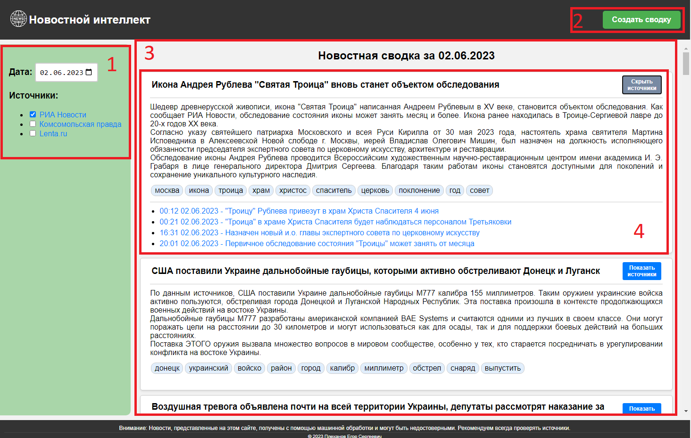
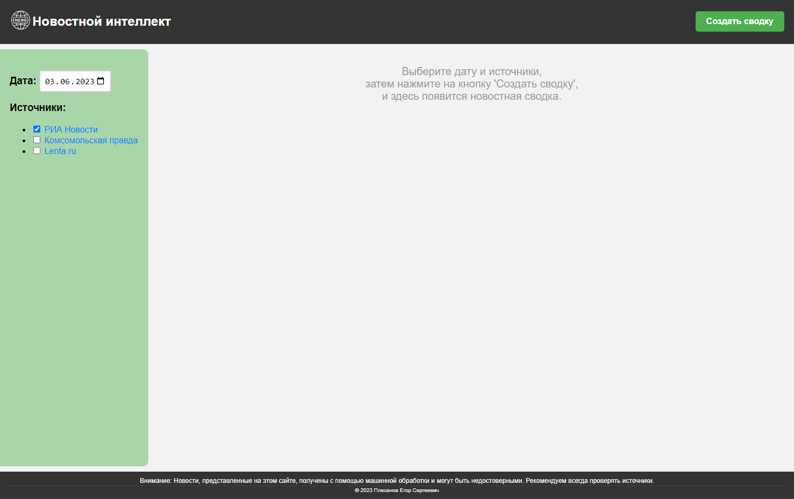
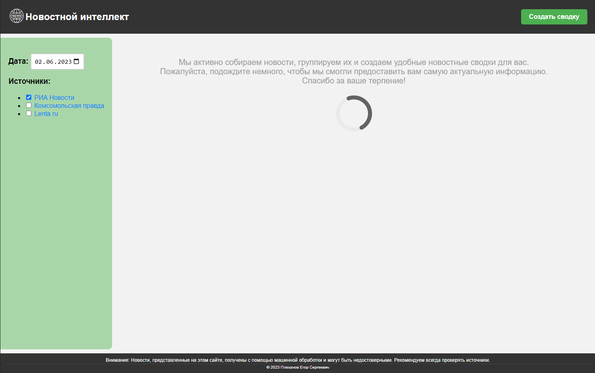
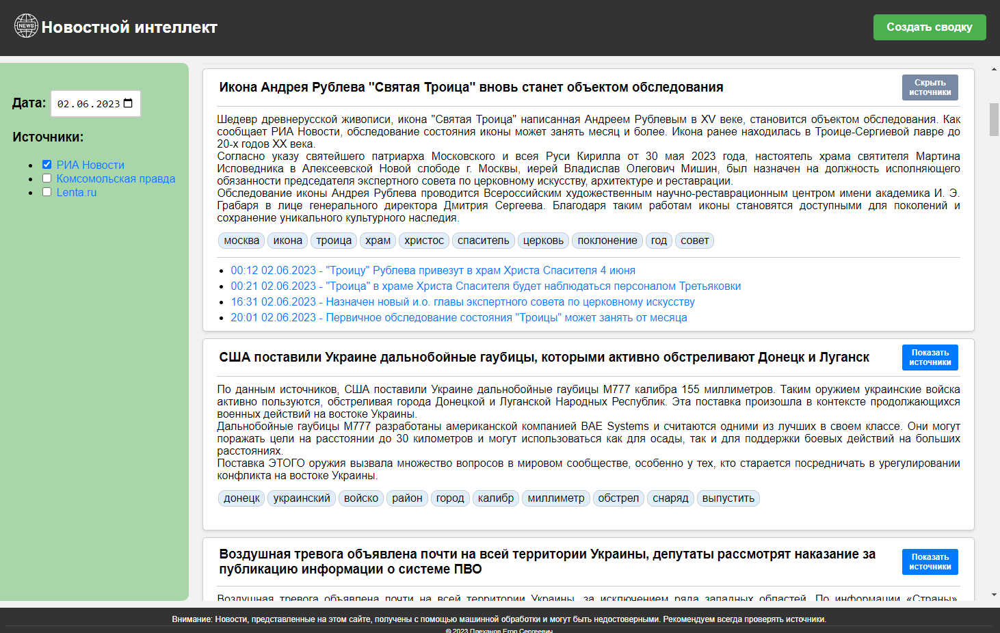
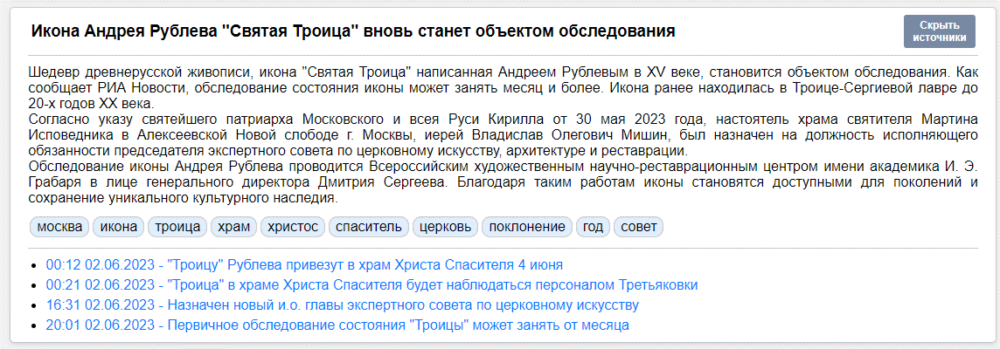

# news_intelligence
Collecting, clustering, summarizing and generating news bulletins using СhatGPT (gpt-3.5-turbo)

## Page structure

- Block 1: Date and source selection elements for generating a news digest.
- Block 2: Button to initiate the generation of a news digest.
- Block 3: Scrollable list displaying the results of generated news digests.
- Block 4: News digest card containing the generated content.

### Instructions for Use

#### Step 1: Launching the Application
To launch the application, open the main application page in your web browser. You will be presented with a page displaying instructions on how to create a news digest, as shown in Figure B.2.

#### Step 2: Viewing News Digests
- After launching the application, the main page will display a list of available news sources on the left, from which you can gather news for generating a digest. There will also be a date selection field. In the center of the page, the results of digest creation will be displayed, and at the top, there will be a button to initiate the process.
- Select the desired news sources and date. Then, click the "Create Digest" button to start the data collection and processing process, if it has not been performed previously with the specified parameters. At this moment, a loading message will appear on the screen, as shown in Figure B.3. If the processing has been performed before, the results will immediately appear on the screen, as shown in Figure B.4, which were previously saved in the database.

#### Step 3: Reading News Digests
- After the news collection and processing is complete, shortened texts of news clusters will appear on the page.
- Each cluster consists of multiple news articles grouped by topic.
- For each cluster, a title and a shortened text are generated, along with highlighted keywords and all the links to the original news articles for detailed information, as shown in Figure B.5.

#### Step 4: Navigating the Application
- The application also provides scrolling through news digest cards, allowing you to switch between different news topics.
- Use the scrolling feature to view news digests on other topics.

#### Step 5: Exiting the Application
- To exit the application, simply close the web browser or click the "X" button on the tab.
- If you wish to return and continue from where you left off, simply reopen the application web page. It retains the data of your current session, allowing you to resume from where you left off.

### Detailed Function Description

1. News Collection from Various News Sources
- The application automatically collects news from various sources.
- It utilizes specialized parsers to extract news from each resource.

2. News Grouping by Topic
- After collecting the news, the application analyzes their content and determines which news articles belong to the same topic.
- News articles related to a particular topic are grouped together into a news digest.

3. Generation of Concise News Digests
- The grouped news undergo compression, which identifies the most important information within their texts and keeps only that.
- In the final stage, the compressed texts go through artificial intelligence processing, which transforms the most significant information from the news cluster into coherent and readable text, along with generating a headline for it.

### Recommendations and Tips:

1. Periodically Refresh the News Digest Page
- To receive the latest news, it is recommended to periodically refresh the news digest page.
- Click the "Create Digest" button in your web browser to fetch the latest news based on your selected parameters. This note applies to the digest for the current day. The data in the database is updated every hour.

2. Customize Your News Preferences
- The application provides the option to select news sources and dates to receive more relevant digests.
- Consider choosing your preferred news sources and dates from the left panel on the application screen.

3. Refer to the Original Sources
- When using the application, it is important to understand that the information provided in the news digests undergoes machine processing and topic consolidation. As a result of this process, there may be some confusion or loss of details from the original news articles. Therefore, it is always recommended to refer to the original news sources for comprehensive and accurate information.
- The developed resource aims to provide you with a new experience of interacting with news information by allowing you to receive news digests on various topics in a convenient format. However, it is not possible to guarantee absolute accuracy and completeness of the news digests as they are the result of automated processing.
- Therefore, if you require more detailed or reliable information about a specific news article, it is recommended to consult the original news source, which is provided in each card and can be accessed by clicking the "Show Sources" button. Verifying sources is an important practice that will help you obtain objective and reliable information, form a complete picture of events, and make informed decisions based on trusted sources.
